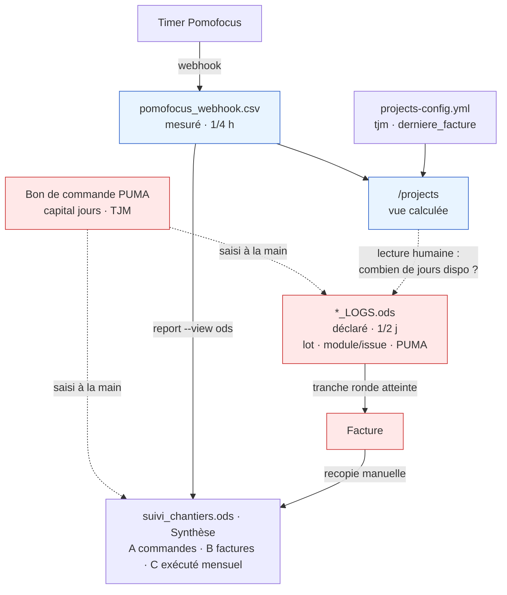

# Chantier — automatisation des logs client + facturation

Statut : cadrage — ouvert le 2026-08-05
Annexe : [`FACTURATION.md`](FACTURATION.md) — analyse du 2026-07-31, **reconstitution
non validée**, à confirmer ou corriger au fil de ce chantier.
Corrections manuelles hors code : `TODO.md` § « Facturation — corrections hors dépôt ».

Ce document est le cahier des charges vivant du chantier : il dit ce qui existe,
comment c'est relié, comment on fait à la main aujourd'hui, ce qui est déjà
automatisé, et il se termine par le découpage budgété. Chaque ligne de la
section 6 devient une `specs/<feature>.md` avec son propre budget au moment où
elle démarre.

> Objectif du chantier, en une phrase : **réduire le temps passé à fabriquer une
> facture**, en produisant automatiquement tout ce qui est calculable autour des
> lignes de journal — sachant qu'une facture ne se calcule pas, elle se rédige.

---

## 1. Inventaire — documents et informations

### 1.1 Les documents

| Document | Où il vit | Qui l'écrit | Grain | Source de vérité de |
|---|---|---|---|---|
| **Bon de commande client** (PUMA) | chez le client / `administratif_projet/` | client | jours | la **commande** : référence, capital de jours, TJM |
| **`pomofocus_webhook.csv`** | serveur `timer.co-libri.org`, copie locale `webhook-data/` (`timer web_sync`) | le timer (webhook Pomofocus) | session, agrégé au 1/4 h | le temps **mesuré** |
| **`projects-config.yml`** | dépôt `time_tracking` | moi, à la main | projet | `tjm`, `derniere_facture`, couleurs, `git_dirs` |
| **`/projects`** (webhook_receiver) | vue calculée, rien sur disque | l'outil | 1/4 h | rien — c'est une **vue** de CSV + YAML |
| **`suivi_chantiers.ods`** feuille `Synthèse` | racine du dépôt (non suivi) | moi, à la main (+ `timer report --view ods`, `timer eighty-hours --write-ods`) | jour / mois | la **synthèse comptable** : commandes, registre des factures, exécuté mensuel |
| **`IESA_LOGS.ods`** feuille `IESA_LOGS` | `~/00PRO/co-libri.org-2025/chantiers/2025-IESA/administratif_projet/` | moi, à la main | 1/2 j | le temps **déclaré** IESA — **la base de la facture** |
| **`SPEASY_LOGS.ods`** feuilles `logs` + `Charge` | `~/00PRO/…/2025-Speasy/administratif_projet/` | moi, à la main | 1/2 j | le temps **déclaré** speasy + le **plan de charge par issue** |
| **La facture** (PDF) | *à préciser* | *à préciser* | tranche ronde | le **facturé** |

### 1.2 Les informations, et où elles vivent aujourd'hui

| Information | Aujourd'hui | Manque |
|---|---|---|
| référence de commande (PUMA), capital en jours | `Synthèse` tableau A, colonne `PUMA` des `*_LOGS` | ❌ absente du CSV et du YAML |
| TJM | `Synthèse` **et** `projects-config.yml` | dupliqué, deux sources |
| cumul déjà facturé (en jours) | `Synthèse` tableaux A et B | ❌ le YAML ne connaît qu'une **date** |
| devis / dépassement | `Synthèse` tableau A | ❌ absent du YAML, donc `/projects` ne peut pas alerter |
| `lot` (catégorie client) | `*_LOGS` | ❌ nulle part côté outil |
| `module` (IESA) / `Issue Id`+`Issue name` (speasy) | `*_LOGS`, feuille `Charge` | ❌ plus saisi dans le timer (163 lignes /1511, aucune récente) |
| description de la tâche | CSV (colonne task) et `*_LOGS` | ⚠️ proches mais pas identiques |
| registre des factures (id, date, qté, HT, TTC, payée, TVA, déclarée) | `Synthèse` tableau B | ❌ hors outil |

### 1.3 Les trois niveaux de « jours » — à ne jamais confondre

| Niveau | Source | Grain | Qui décide |
|---|---|---|---|
| **mesuré** | timer → CSV → `/projects` | 1/4 h | l'outil |
| **déclaré** | `*_LOGS.ods` | 1/2 j | moi, en écrivant le journal |
| **facturé** | registre / colonne `Facture` | tranche ronde (5, 8, 9, 13 j) | moi, en émettant la facture |

« Reste à facturer » de la Synthèse = **mesuré − déclaré** = le stock de jours
mesurés pas encore écrits dans le journal. C'est la matière première des
prochaines lignes de log.

---

## 2. Les liens — le schéma

Le trait en pointillé entre `/projects` et `*_LOGS` est **tout le sujet du
chantier** : c'est aujourd'hui une lecture humaine, suivie d'une décision et
d'une saisie à la main.

### 2.1 Les clés de jointure

| Clé | Dans le CSV | Dans `Synthèse` | Dans `*_LOGS` | État |
|---|---|---|---|---|
| **mois** | date de session | tableau C (`juin_26`…) | colonne `date` (mois en lettres) | ✅ aligné |
| **jours** | minutes ÷ 60 ÷ 8, arrondi 1/4 h | `exécuté` | `jours` / `temps (j)`, arrondi 1/2 j | ✅ convertible |
| **projet** | `project` (`speasy`, `calipso_lees`) | ligne projet | colonne `Projet` (`calipso`, `lees`, `helioswarm`) | ⚠️ proche, pas aligné — `helioswarm` inconnu du CSV |
| **commande** | — | `Commande` + n° PUMA | colonne `PUMA` | ❌ **absente du CSV** — le vrai chaînon manquant |
| **lot** | sous-projet `_iesa` / `_lees` = **lot technique** | `Lot facturé` (tableau B) = **commande** | `lot` = **catégorie client** | ❌ trois notions sous un même mot |
| **issue / module** | `#<id> <nom>: <desc>` dans task (163/1511 lignes) | — | `module` (IESA) · `Issue Id`+`Issue name` (speasy) | ❌ plus saisi |
| **facture** | — | tableau B (id, date, payée) | `Num Facture`, `Qté (j)`, `HT`, `TTC` | ⚠️ deux copies, déjà divergentes (cf. décision D1) |

Deux axes de découpage coexistent et **ne sont pas emboîtés** :
`calipso_a` / `calipso_b` / `calipso_c` sont des **commandes** ;
`calipso_iesa` / `calipso_lees` sont des **lots techniques**.
Le détail par sous-projet livré en v0.14.0 ne suit que le second — donc pas
l'axe de la facturation.

---

## 3. Le workflow manuel aujourd'hui

> À remplir. Un pas = une action réelle, dans l'ordre, avec **la durée
> chronométrée** (pas estimée) et le document touché. Sans ces durées, la
> section 6 se priorise à l'intuition.

| # | Pas | Document touché | Durée |
|---|---|---|---|
| 1 |  |  |  |
| 2 |  |  |  |
| 3 |  |  |  |

Questions à couvrir au passage : quel est l'élément déclencheur (fin de mois ?
tranche atteinte ? relance client ?) — comment se choisit la tranche ronde —
comment se répartissent les jours entre lots et issues — dans quel ordre sont
mis à jour `*_LOGS`, la facture et la `Synthèse`.

---

## 4. Ce qui est déjà automatisé

> À remplir en face de chaque pas de la section 3 : ✅ automatisé · 🟡 semi ·
> ❌ manuel. Point de départ de ce qui existe :

| Brique existante | Ce qu'elle couvre |
|---|---|
| `timer web_sync` | récupère le CSV du serveur |
| `/projects` | jours + € mesurés depuis `derniere_facture`, détail par sous-projet, arrondi 1/4 h |
| `/weeks`, `/months`, `/live` | suivi de charge, pas facturation |
| `timer report --view ods` | écrit l'exécuté mensuel dans `suivi_chantiers.ods` |
| `timer eighty-hours --write-ods` | heures journalières facturables |
| `timer report --view export` / `project-logs` | sorties texte proches des lignes de journal |

---

## 5. Décisions à trancher avant tout code

- [ ] **D1 — Le n° et la date de la 3ᵉ facture speasy.** `FA20260629` dans
      SPEASY_LOGS contre `FA20260619` daté du 19/06 dans la `Synthèse`, et
      `derniere_facture: "20260619"` dans le YAML. Dix jours d'écart.
      **Bloquant** : si le 29/06 est le bon, `/projects` sur-compte speasy de
      1,32 j (4,89 → 3,57 j) — le chiffre affiché aujourd'hui est faux.
      → action manuelle, déjà dans `TODO.md`.

- [ ] **D2 — Rétablir la discipline `#<issue_id> <issue_name>: <description>`
      dans le timer ?** C'est la condition pour que le brouillon de lignes de
      journal soit réellement automatique, et ça alimenterait aussi la feuille
      `Charge` de SPEASY_LOGS. Sinon, `Issue Id` restera une saisie manuelle
      après coup. Décision de **méthode de travail**, pas de code — mais tout
      l'étage 2 en dépend.

- [ ] **D3 — Où vivent commande, lot et module ?** Config YAML enrichie, ou
      lecture directe des ODS ? Contrainte forte : le conteneur webhook n'a
      volontairement ni `pandas` ni `odfpy`
      (cf. `specs/backfill-ods-webhook-csv.md`). Une lecture ODS impose soit
      d'alourdir l'image, soit un export intermédiaire.

- [ ] **D4 — Comment faire coexister l'axe commande et l'axe lot technique ?**
      Une commande peut porter plusieurs lots techniques ; un lot peut
      s'étaler sur deux commandes. Modèle à choisir avant de toucher
      `projects-config.yml`.

- [ ] **D5 — Ouvrir `calipso_c` ?** 2 j restent facturables sur `calipso_b`
      (20 commandés − 18 facturés) ; les 3,91 j restants sont réalisés **hors
      commande**. Décision commerciale, mais elle conditionne ce que l'outil
      doit afficher (« à reporter sur la commande suivante » n'a de sens que si
      la commande suivante existe).

- [ ] **D6 — Corriger d'abord les données, ou coder autour ?** La colonne `PUMA`
      de SPEASY_LOGS est corrompue (référence incrémentée ligne à ligne),
      `IESA_LOGS` a deux lignes douteuses, le tableau C ignore `carangues`
      depuis février. Coder sur des données fausses fera passer les bugs pour
      des bugs de code. → corrections listées dans `TODO.md`.

- [ ] **D7 — `helioswarm` et le périmètre projet.** Il apparaît dans
      `IESA_LOGS` mais n'existe pas côté CSV. Projet à part entière, ou lot de
      calipso ?

---

## 6. Découpage budgété

> Le budget se décide **ici**, à froid, avant le plan de chaque feature.
> Une ligne = une future `specs/<nom>.md`. Ligne cochée = feature clôturée.
> Lignes ci-dessous : candidates issues de « Piste pour le chantier » de
> `FACTURATION.md` — à trier, couper et budgéter.

| # | Feature candidate | Ce que ça supprime du workflow manuel (§3) | Budget | Statut |
|---|---|---|---|---|
| 0 | Corrections manuelles hors code (D1, D6) | fiabilise le point de départ | — | `TODO.md` |
| 1 | Modèle « commande » dans `projects-config.yml` (PUMA, capital, TJM, cumul facturé) | remplace `derniere_facture` | | |
| 2 | `/projects` par commande : stock mesuré · reste sur commande · facturable · à reporter | la reconstitution à la main du tableau de décision | | |
| 3 | Alerte dépassement de devis | la vérification manuelle « ai-je encore de la commande ? » | | |
| 4 | Brouillon de lignes de journal (mois, projet, description, jours arrondis 1/2 j) | la saisie de la partie calculable de `*_LOGS` | | |
| 5 | Ajustement à la tranche ronde (répartition des jours pour tomber juste) | le calcul manuel de la dernière ligne avant facture | | |
| 6 | Registre des factures dans l'outil (id, date, qté, payée) | la double saisie `*_LOGS` ↔ `Synthèse` | | |

Le backlog qui ne rentre pas dans ce chantier part dans `TODO.md`, pas ici.

---

## Journal du chantier

<!-- une ligne par session : date, ce qui a avancé, prochaine étape -->
- 2026-08-05 — ouverture. Sections 1, 2 et 5 reprises de `FACTURATION.md`.
  Prochaine étape : chronométrer le workflow manuel (§3) sur la prochaine
  facture réelle.
